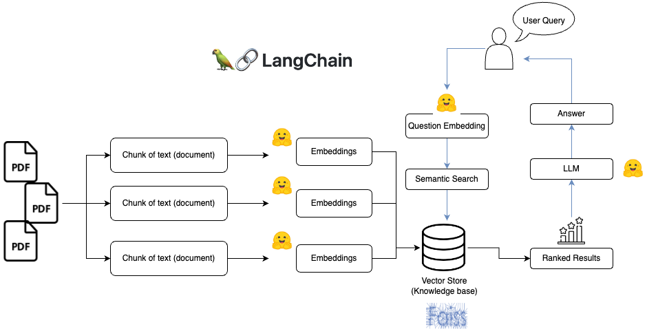

# Multiple Choice Question from PDFs
This project demostrats how to query your knowlegde base. This Python project requires user to upload a PDF and ask questions related to
the data in the PDF. Internally the application uses a LLM to generate a response about your PDF. 

# Under the hood 
The application reads the text from  PDF and splits the text into smaller chunks that can be then fed into a LLM. It uses Huggingface SentenceTransformer embeddings to create vector representations of the chunks. The application then finds the chunks that are semantically similar to the question that the user asked and feeds those chunks to the LLM to generate a response. 

The resonse and question are passed to OpenAI chatmodels to generate Multiple choice question.

The application uses Streamlit to create the GUI and Langchain to communicate with the LLM.





# Setup
To install the repository, please clone this repository and install the requirements:
```
pip install -r requirements.txt
```
You will also need to add your **HUGGINGFACE_API_TOKEN** and **OPENAI_API_KEY** to the .env file.

# Usage
To use the application, run the app.py file with the streamlit CLI (after having installed streamlit):
```
streamlit run app.py
```
